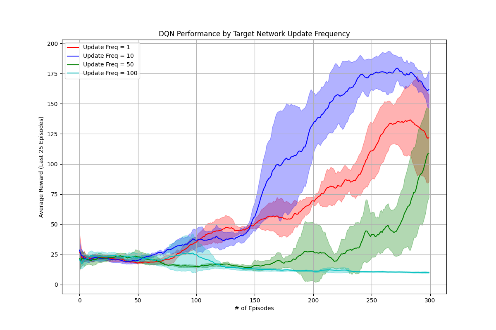

# 強化學習作業一：MDP、Q-Learning 與 DQN

> **課程：** [CS885 強化學習](https://cs.uwaterloo.ca/~ppoupart/teaching/cs885-winter22/assignments.html)

---

## 📚 專案概述

本專案實作了一系列強化學習演算法，涵蓋以下三個主要部分：

- **Part I：馬可夫決策過程 (MDP)** - 基於模型的規劃演算法
- **Part II：Q-Learning** - 無模型的表格型學習方法
- **Part III：深度 Q 網路 (DQN)** - 處理連續狀態空間的深度強化學習

---

## 📂 專案結構

### Part I: 馬可夫決策過程 (MDP)

| 檔案 | 說明 |
|------|------|
| `MDP.py` | 實作 Value Iteration、Policy Iteration 和 Modified Policy Iteration |
| `TestMDPmaze.py` | 使用迷宮問題測試 MDP 演算法並生成分析報告 |

### Part II: Q-Learning (表格型)

| 檔案 | 說明 |
|------|------|
| `RL.py` | 實作 Q-Learning 演算法 |
| `testRLmaze.py` | 在迷宮問題上分析不同 epsilon 探索率的影響 |

### Part III: 深度 Q 網路 (DQN)

| 檔案/資料夾 | 說明 |
|------------|------|
| `DQN.py` | 使用 PyTorch 實作 DQN 解決 CartPole 問題 |
| `utils/` | 包含輔助函式（如 buffers.py, envs.py 等） |

---

## ⚙️ 環境設定

### 系統需求

本專案的 Part III 使用較舊版本的 gym 函式庫，與 NumPy 2.0 不相容。請按照以下步驟建立虛擬環境。

### 建立虛擬環境

```bash
# 建立新的 conda 環境
conda create -n rl_assignment python=3.9
conda activate rl_assignment
```

### 安裝相依套件

```bash
# PyTorch (用於 Part III)
pip install torch

# OpenAI Gym (用於 Part III)
pip install gym

# Matplotlib (用於繪圖)
pip install matplotlib

# TQDM (用於進度條)
pip install tqdm

# 降級 NumPy 以避免相容性問題
pip uninstall numpy
pip install numpy==1.26.4
```

> ⚠️ **重要：** 必須使用 NumPy 1.26.4 以避免 `AttributeError: module 'numpy' has no attribute 'bool8'` 錯誤。

---

## 🚀 執行方式

請在終端機中切換到專案資料夾，然後執行以下指令：

### Part I: MDP 演算法分析

```bash
python TestMDPmaze.py
```

**功能說明：** 在 4×4 迷宮問題上執行並比較三種 MDP 演算法。

**預期輸出：**

```
========= MDP Analysis Report =========

任務一：價值迭代 (Value Iteration)
收斂迭代次數: 21

最終策略 (Policy):
[3 3 1 1 1 3 1 1 1 1 1 2 3 3 0 0 0]

最終價值函數 (Value Function):
[ 57.4098  62.3550  67.7796  64.9628  58.6209
  62.3180  74.5859  70.2015  63.3315   7.4705
  82.8905  75.5884  75.7965  83.6571 100.
  72.8694   0.    ]

任務二：策略迭代 (Policy Iteration)
收斂迭代次數: 6

最佳策略 (Policy):
[3 3 1 1 1 3 1 1 1 1 1 2 3 3 0 0 0]

最佳價值函數 (Value Function):
[ 57.4158  62.3582  67.7814  64.9647  58.6214
  62.3194  74.5865  70.2024  63.3316   7.4705
  82.8906  75.5888  75.7966  83.6571 100.
  72.8701   0.    ]

--- Task 3: Modified Policy Iteration Experiment Report ---
| k (Partial Evals) | Total Iterations to Converge |
|------------------:|-----------------------------:|
|                 1 |                           21 |
|                 2 |                           12 |
|                 3 |                            9 |
|                 4 |                            8 |
|                 5 |                            7 |
|                 6 |                            7 |
|                 7 |                            7 |
|                 8 |                            7 |
|                 9 |                            6 |
|                10 |                            7 |
```

### Part II: Q-Learning 實驗

```bash
python testRLmaze.py
```

**功能說明：** 執行 100 次試驗比較 4 種不同 epsilon 值的效果。

**預期輸出：**
- 生成並儲存 `qlearning_rewards.png`
- 自動顯示結果圖表


### Part III: DQN 實驗

```bash
python DQN.py
```

**功能說明：** 依序執行兩個 DQN 實驗並生成比較圖表。

**實驗一：目標網路更新頻率比較**
- 生成並儲存 `target_frequency_comparison.png`



**實驗二：最小批次大小比較**
- 生成並儲存 `minibatch_size_comparison.png`


---

## 📊 實驗結果與討論

### Part I: Modified Policy Iteration 分析

#### 🔍 部分評估次數 (k) 的影響

| k 值範圍 | 收斂次數 | 特徵 |
|---------|---------|------|
| k = 1 | 21 次 | 等同於 Value Iteration |
| k = 3-4 | 9-8 次 | 快速改善階段 |
| k ≥ 5 | 6-7 次 | 接近 Policy Iteration |

**核心洞察：**

- **小 k 值：** 策略評估粗略，需更多迭代才能收斂
- **大 k 值：** 策略評估精確，能快速找到最佳策略
- **最佳平衡點：** k ≈ 5 達到效率與精確度的最佳權衡

#### 🔗 與經典演算法的關係

```
Value Iteration (21 次)  ←─────  MPI (k=1)
         ↓                         ↓
    更新精確度逐漸提升          k 值逐漸增加
         ↓                         ↓
Policy Iteration (6 次)  ←─────  MPI (k=9)
```

**理論意義：** MPI 統一了 VI 和 PI 的框架，提供了計算成本與收斂速度間的彈性權衡。

---

### Part II: Q-Learning 的 Epsilon 探索策略

#### 📉 訓練表現比較

根據 `qlearning_rewards.png` 的實驗結果：

| Epsilon 值 | 學習速度 | 最終獎勵 | 穩定性 |
|-----------|---------|---------|--------|
| 0.5 (高探索) | 慢 | 低 | 差 |
| 0.3 (中高探索) | 中 | 中低 | 中 |
| 0.1 (低探索) | 快 | 高 | 優 |
| 0.05 (極低探索) | 快 | 高 | 優 |

#### ⚖️ 探索與利用的權衡

**高 Epsilon (ε ≥ 0.3)**
- ✅ 優點：探索廣泛，避免局部最優
- ❌ 缺點：隨機動作干擾學習，收斂慢且不穩定

**低 Epsilon (ε ≤ 0.1)**
- ✅ 優點：快速收斂，獲得高獎勵
- ❌ 缺點：可能陷入次優策略

**關鍵發現：** 對於迷宮問題，ε = 0.05-0.1 達到最佳平衡，既保留足夠探索又能充分利用已學知識。

#### 🎯 對 Q-values 和策略的影響

- **高 ε：** Q-table 更新更全面，但收斂慢
- **低 ε：** Q-values 集中在最佳路徑，但可能忽略其他區域

---

### Part III: DQN 超參數實驗

#### 實驗一：目標網路更新頻率

基於 `target_frequency_comparison.png` 的分析：

| 更新頻率 | 學習表現 | 問題 |
|---------|---------|------|
| Freq = 1 | ⚠️ 極不穩定 | 追逐移動目標，難以收斂 |
| Freq = 10 | ✅ 最佳 | 穩定性與及時性的最佳平衡 |
| Freq = 50-100 | ❌ 學習緩慢 | 目標過於陳舊，無法跟上進步 |

**與 Value Iteration 的連結：**

目標網路 $Q_t$ 扮演固定的 $V_k$ 角色，主網路 $Q$ 則是正在更新的 $V_{k+1}$。凍結 $Q_t$ 提供穩定的學習目標，正如 VI 使用固定的 $V_k$ 來計算 $V_{k+1}$：

$$V_{k+1}(s) \leftarrow \max_a \left[ R(s,a) + \gamma \sum_{s'} T(s,a,s') V_k(s') \right]$$

**結論：** Freq = 10 在「目標穩定性」與「目標時效性」間取得最佳平衡。

#### 實驗二：Minibatch Size

基於 `minibatch_size_comparison.png` 的分析：

| Batch Size | 梯度品質 | 學習效果 |
|-----------|---------|---------|
| Size = 1 | 高噪音 (SGD) | 最慢最不穩定 |
| Size = 10 | 中等噪音 | 仍有較大變異 |
| Size = 50-100 | 低噪音 | 快速且穩定 |

**與精確梯度下降的關係：**

```
Size = 1 (SGD)  ───→  高變異、噪音大
     ↓
Size = 10      ───→  噪音減少
     ↓
Size = 50-100  ───→  接近精確梯度
     ↓
全部樣本        ───→  精確 GD (高成本)
```

**核心機制：**
- Replay Buffer 扮演「數據集」角色
- 較大的 batch size 提供更準確的梯度估計
- 降低更新方向的隨機性，使學習更穩定

**結論：** Size = 50-100 在計算效率和梯度準確性間達到最佳權衡。

---


